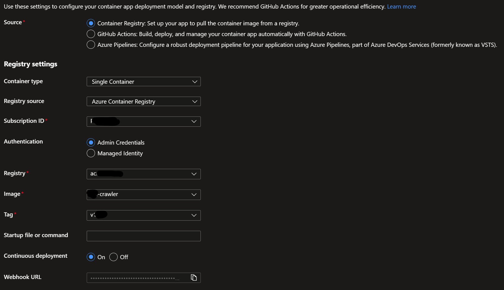
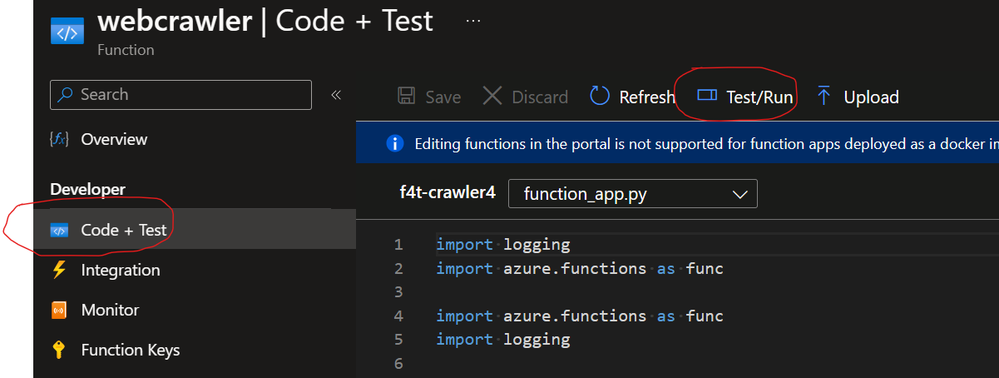

# Web Crawler Function

The web crawler is an add-on component for Chat bot [solution accelerator](https://github.com/Azure-Samples/azure-search-openai-demo) to index data from the web in Azure AI Search. The crawler assumes the following resources already exist as part of chat bot solution accelerator:

1. Azure AI Search

2. Azure Open AI

   Embedding model

3. Document Intelligence

## Prerequisites

1. Create a resource group
1. [Create a Azure Container Registry.](https://learn.microsoft.com/en-us/azure/container-registry/container-registry-get-started-portal?tabs=azure-cli#sign-in-to-azure)
1. [Create Azure Cosmos DB account](https://learn.microsoft.com/en-us/azure/cosmos-db/nosql/quickstart-portal#create-account)

## Enable Admin Account for ACR

[Follow the steps using the portal to enable the Admin account.](https://learn.microsoft.com/en-us/azure/container-registry/container-registry-authentication?tabs=azure-cli#admin-account)

## Docker Image Creation and Push to Azure Container Registry

Change into the directory container the Dockerfile

```ps
cd <path-to-directory-with-Dockerfile>
```

Login to Azure Container Registry

```ps
az acr login --name <azure-container-registry-name> -t
```

Build the container image. You can change the --image name and tag as needed.

```ps
az acr build --image crawler/f4t-crawler:v1 --registry <azure-container-registry-name> --file Dockerfile .
```

## Create Azure Function using Containers

1. Follow the steps to [create Azure Function App using containers.](https://learn.microsoft.com/en-us/azure/azure-functions/functions-how-to-custom-container?tabs=core-tools%2Cacr%2Cazure-cli&pivots=azure-functions#azure-portal-create-using-containers)

    **NOTE**: For hosting plan, choose App Service Plan.

1. Go to Deployment Center and select the options as shown below:

    

1. Click Save and switch to Logs tab to review logs for successful deployment.


## Configure Crawler Function

Add the following environment variables to the Azure Function App.

| Configuration | Description | Value Sample |
|---------------|-------------|-------|
| BASE_URLS     | The comma separated list of base urls to crawl. Links on this page will be extracted and crawled. | http://www.url1.com,http://www.url2.com |
| EXTRACT_LINK_TYPE | The type of links to extract when crawling Base Urls | pdf |
| CRAWL_URLS | The comma separated  list of urls to crawl. No links will be extracted and crawled, only the Urls will be crawled. | http://www.url1.com,http://www.url2.com |
| EXCLUDE_LIST | The comma separated list of urls to exclude from crawling. | http://www.url1.com,http://www.url2.com |
| INCLUDE_DOMAINS | The comma separated list of domains to include during crawling. | www.url1.com,www.url2.com |
| INDEX_NAME | The name of the index to create in AI Search. | gptkbindex7 |
| SEARCH_ENDPOINT | The endpoint for the AI Search service. | https://<search_name>.search.windows.net |
| SEARCH_KEY | The admin key for the AI Search service. | <search_admin_key> |
| EMBEDDING_MODEL_ENDPOINT | Azure Open AI text embedding model endpoint. | https://<open_ai_name>.azure.com/openai/deployments/text-embedding-ada-002/embeddings |
| EMBEDDING_MODEL_KEY | Azure Open AI key. | <open_ai_key> |
| ENABLE_VECTORS | Flag to enable/disable vector (embeddings) computations. | True = Enabled |
| FORM_RECOGNIZER_ENDPOINT | The Document Intelligence service endpoint. | https://<document_intelligence_name>.cognitiveservices.azure.com/ |
| FORM_RECOGNIZER_KEY | The Document Intelligence service key. | <document_intelligence_key> |
| NUM_OF_THREADS | The number of crawler threads. | 4 |
| COSMOS_URL | The Cosmos DB account endpoint for storing the crawler logs. | https://<cosmosdb_account>.documents.azure.com:443/ |
| COSMOS_DB_KEY | The key for Cosmos DB account | <cosmosdb_key> |

**Note**: For all credentials and service keys, it is recommended that these are stored in Azure KeyVault for security reasons. Refer to documentation [here](https://learn.microsoft.com/en-us/azure/app-service/app-service-key-vault-references?tabs=azure-cli) for use of Azure KeyVault reference as app settings in Azure Function App.

## Kick off a Test Crawling

1. Go to Overview page of the function app.
2. Select the webcrawler function and go to "Code + Test" and click "Test/Run"

   